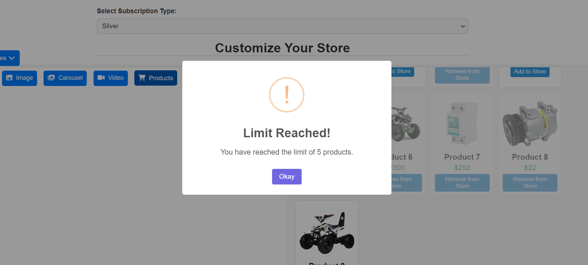

# StoreCustomizer-NextJs-App

StoreCustomizer is a versatile store management and customization application built with Next.js. It enables suppliers to create, view, and manage their online stores efficiently while offering flexible customization options to meet diverse needs.

## Table of Contents

- [Demo](#demo)
- [Features](#features)
- [Installation](#installation)
- [Usage](#usage)
- [Technologies](#technologies)

## Demo

You can see a live demo of the application here:

# https://abderraoufselidja.github.io/StoreCustomizer-NextJs-App/

Or here:

 # https://store-customizer-next-js-app.vercel.app/

## Features

- Real-Time Preview: Suppliers can see live changes while customizing their stores.
- Flexible Content Management: Add, edit, and delete text, tables, images, videos, carousels, and products.
- Subscription Plans: Different feature limitations based on subscription levels (Startup, Silver, Gold, Platinum).
- User-Friendly Interface: Built with an intuitive design for easy navigation and management.

## Subscription Plan Limitations

## Installation

To get a local copy up and running, follow these steps:

1. Clone the repository:

   git clone git@github.com:AbderraoufSelidja/React-MaterialUI-Notes-App.git

2. Navigate to the project directory

3. Install the dependencies:
    npm install

3. Start the development server:
    npm run dev
    
## Technologies

This project is built using the following technologies:

- **Next.js**: A React framework for building server-side rendered applications.
- **Firebase**: A platform for building web and mobile applications that provides a variety of services, including Firestore for database management.
- **SweetAlert**: A beautiful replacement for JavaScript's alert boxes, enhancing the user experience.
- **Froala Text Editor**: A rich text editor that allows for enhanced text editing capabilities.

